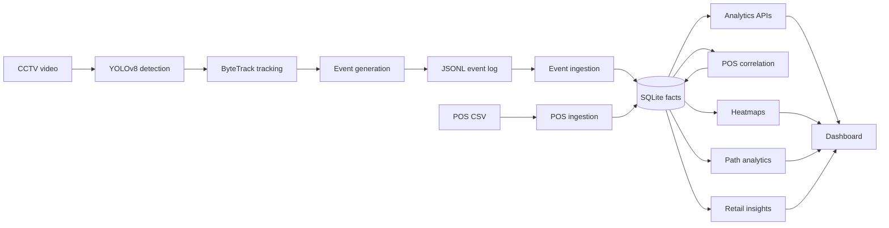

# Store Intelligence System

Purplle Tech Challenge 2026 Submission.

An end-to-end system that converts raw CCTV footage into business intelligence, built with Python, FastAPI, YOLOv8, ByteTrack, deterministic analytics, and a local dashboard.

The submission focuses on practical retail outcomes: reliable event generation, staff/customer filtering, POS correlation, customer journey analytics, heatmaps, and deterministic recommendations that a store operations team can act on.

## Quickstart

```powershell
python -m venv .venv
.\.venv\Scripts\Activate.ps1
pip install -r requirements.txt
python -m pytest
uvicorn app.main:app --reload
```

Open the dashboard at:

```text
http://127.0.0.1:8000/dashboard
```

The API health check is available at `/health`, and FastAPI's generated evaluator-friendly API docs are available at `/docs`.

## Demo Data Flow

For the dashboard demo stores, generate aligned demo POS rows, ingest them, and rerun correlation:

```powershell
python -m pipeline.generate_demo_pos
python -m pipeline.ingest_pos data/demo_pos_st1001_st1002.csv
python -c "from app.db.session import init_db, SessionLocal; from app.services.correlation_service import CorrelationService; init_db(); db=SessionLocal(); CorrelationService(db).correlate_all(replace_existing=True); db.commit(); db.close()"
```

The last command is the exact correlation rerun command. It clears existing `TransactionCorrelation` rows and recomputes matches from the current visits and POS transactions.

## Demo Walkthrough

Run these commands from the repository root.

1. Generate CCTV events from the configured video assets:

```powershell
python -m pipeline.video.process_videos --output data/generated_cctv_events.jsonl
```

For a faster smoke run:

```powershell
python -m pipeline.video.process_videos --output data/generated_cctv_events.jsonl --max-frames 500
```

2. Validate the JSONL event log:

```powershell
python -c "import json; from pathlib import Path; from pydantic import TypeAdapter; from app.schemas.event import EventPayload; path=Path('data/generated_cctv_events.jsonl'); adapter=TypeAdapter(EventPayload); events=[adapter.validate_python(json.loads(line)) for line in path.open(encoding='utf-8') if line.strip()]; print(f'{len(events)} valid JSONL events in {path}')"
```

3. Import generated CCTV events:

```powershell
python -m pipeline.ingest_events data/generated_cctv_events.jsonl
```

4. Generate and import the transparent demo POS fixture:

```powershell
python -m pipeline.generate_demo_pos
python -m pipeline.ingest_pos data/demo_pos_st1001_st1002.csv
```

5. Rerun visit-to-POS correlation:

```powershell
python -c "from app.db.session import init_db, SessionLocal; from app.services.correlation_service import CorrelationService; init_db(); db=SessionLocal(); CorrelationService(db).correlate_all(replace_existing=True); db.commit(); db.close()"
```

6. Launch the API and dashboard:

```powershell
uvicorn app.main:app --reload
```

7. Review analytics at:

```text
http://127.0.0.1:8000/dashboard
```

8. Review heatmaps in the Overview panel.
9. Review customer journeys in the Paths panel.
10. Review deterministic recommendations in the Insights panel.

API contracts are available at:

```text
http://127.0.0.1:8000/docs
```

## Mandatory Deliverables

- Event log JSONL: `data/generated_cctv_events.jsonl`
- README: `README.md`
- Design document with AI-assisted decisions: `docs/DESIGN.md`
- Engineering choices: `docs/CHOICES.md`

Validate the generated event log before submission:

```powershell
python -c "import json; from pathlib import Path; from pydantic import TypeAdapter; from app.schemas.event import EventPayload; path=Path('data/generated_cctv_events.jsonl'); adapter=TypeAdapter(EventPayload); events=[adapter.validate_python(json.loads(line)) for line in path.open(encoding='utf-8') if line.strip()]; print(f'{len(events)} valid JSONL events in {path}')"
```

The current checked event log validates to 124 events against the project `EventPayload` schema.

## Evaluator Setup

1. Use Python 3.11 or newer.
2. Install dependencies with `pip install -r requirements.txt`.
3. Run `python -m pytest` to verify ingestion, correlation, analytics API, dashboard static checks, and video event generation tests.
4. Validate `data/generated_cctv_events.jsonl` with the command above.
5. Start the local app with `uvicorn app.main:app --reload`.
6. Visit `http://127.0.0.1:8000/dashboard` for the dashboard and `http://127.0.0.1:8000/docs` for API inspection.
7. No external database is required; the submission uses local SQLite by default.

## Dataset Provenance and Demo Data

The project distinguishes original challenge data, generated event logs, and demo-only alignment fixtures.

- Original challenge CCTV videos: provided by the challenge organizers and processed locally by the YOLOv8 + ByteTrack pipeline. These raw videos should not be committed to a public repository.
- Original challenge POS sample: retained as source data for POS schema validation and product/brand patterns. It belongs to a different store than the generated CCTV event stores, so the correlation engine should not force a match.
- Generated CCTV events: `data/generated_cctv_events.jsonl` is the mandatory event-log deliverable emitted by the video pipeline and validated against the project event schema.
- Generated demo POS fixture: `data/demo_pos_st1001_st1002.csv` is synthetic alignment data for dashboard evaluation. It exists because the original POS sample store does not align with the generated CCTV dashboard stores.

The demo POS fixture is transparent and ethical: it is not represented as original observed sales. It allows judges to evaluate conversion, revenue attribution, and POS correlation behavior without hardcoded UI metrics. Generated demo checkout events are deterministic support facts used to exercise the unchanged correlation service. Dashboard revenue and conversion metrics still come from persisted POS, visit, event, and correlation records.

## Business Impact

This system turns CCTV and POS records into operational intelligence that store teams can use without reading raw video.

- Operational value: converts noisy visual activity into structured events, measurable queue behavior, staff-filtered customer metrics, and repeatable dashboard views.
- Retail value: connects customer movement, zone engagement, checkout behavior, and POS attribution into a single store-performance picture.
- Conversion optimization: identifies funnel drop-offs from visit to queue to purchase, helping teams find where shoppers disengage.
- Queue reduction: surfaces abandonment and wait-time risks so managers can open counters or adjust staffing during peak periods.
- Store layout optimization: heatmaps and zone dwell highlight hot zones, dead zones, and areas where shoppers need clearer merchandising or assistance.
- Customer journey understanding: path analytics shows common journeys, purchase journeys, and drop-off paths so store changes can be made around actual behavior.

## Architecture



The architecture is intentionally modular: event generation can run offline, ingestion and analytics share the same persisted facts, and dashboard views consume typed FastAPI endpoints rather than querying the database directly.

## Implementation Status

Implemented for this submission:

- FastAPI app, health route, event ingestion, analytics routes, and dashboard static serving.
- SQLAlchemy models for stores, cameras, zones, tracked entities, visits, events, POS transactions, POS items, and transaction correlations.
- Queue event support, POS ingestion, confidence-scored correlation, analytics metrics/funnel/heatmap services, dashboard UI, and tests.
- Video-to-event generation pipeline using YOLOv8 and tracking adapters.
- Explainable staff detection and group detection heuristics with dashboard metrics.
- Deterministic retail insights for queue, zone, conversion, visitor, and revenue recommendations.
- Customer path analytics for common journeys, purchase journeys, and drop-off paths.

Roadmap / design-not-fully-implemented items are explicitly treated as future work in the docs:

- Full raw-event archive table and replay workflow.
- Production-grade identity alias mapping and cross-camera ReID.
- Advanced anomaly detection, streaming dashboard updates, and production database migration setup.

## Screenshots

Add final screenshots in `docs/screenshots/` or attach them in the submission portal. Suggested captures:

### Overview Dashboard

Placeholder: `docs/screenshots/overview-dashboard.png`

Caption: Shows store-level KPIs including visitors, staff-filtered counts, groups, conversion, revenue, dwell, and queue abandonment.

### Heatmap

Placeholder: `docs/screenshots/heatmap.png`

Caption: Demonstrates hotspot density over the store layout using generated CCTV event coordinates.

### Funnel

Placeholder: `docs/screenshots/funnel.png`

Caption: Shows visitor progression from store visit to queue engagement, queue completion, and purchase.

### Store Comparison

Placeholder: `docs/screenshots/store-comparison.png`

Caption: Compares store-level conversion, revenue, dwell, and queue abandonment across the demo stores.

### Path Analytics

Placeholder: `docs/screenshots/path-analytics.png`

Caption: Shows most common customer paths, purchase journeys, and drop-off paths derived from event sequences.

### Insights

Placeholder: `docs/screenshots/insights.png`

Caption: Shows deterministic business recommendations with severity, explanation, and action.

## Judge Experience Review

This repository is organized so an evaluator can inspect it quickly:

- Start with `README.md` for setup, deliverables, data transparency, architecture, and walkthrough.
- Use `docs/DESIGN.md` for architecture, AI-assisted decisions, path analytics, insights, and ReID feasibility.
- Use `docs/CHOICES.md` for model selection, schema design, API architecture, and tradeoffs.
- Use `docs/DASHBOARD.md` for dashboard views and API contracts.
- Use `data/generated_cctv_events.jsonl` as the mandatory event-log deliverable.

Potential points of confusion and how they are handled:

- Raw videos and original challenge datasets should not be committed publicly; `.gitignore` keeps raw `data/` files excluded while allowing the generated event log.
- The demo POS fixture is synthetic and clearly labeled. It exists only to evaluate correlation and dashboard revenue for stores that align with generated CCTV events.
- ReID is documented as a roadmap item, not claimed as implemented, because heuristic stitching could destabilize visitor counts without calibrated topology.
- `docs/PROJECT_AUDIT.md` is a historical Phase 0 audit and is labeled as such.

## Final Readiness Report

Repository strengths:

- End-to-end CCTV-to-dashboard pipeline with JSONL event output.
- Typed FastAPI endpoints for metrics, funnels, heatmaps, paths, insights, and layouts.
- Confidence-scored POS correlation with no-match handling.
- Staff exclusion, group detection, re-entry behavior, path analytics, and deterministic recommendations.
- Transparent demo data handling and reproducible local setup.
- 53 passing tests covering ingestion, POS, correlation, analytics, dashboard static integration, video event generation, staff/group inference, insights, and path analytics.

Remaining limitations:

- Cross-camera ReID is not implemented; it is documented as roadmap because safe stitching needs calibrated topology and confidence modeling.
- Raw-event replay and production migrations are roadmap items.
- The dashboard is static and polling-based, suitable for challenge evaluation but not a full production command center.

Known tradeoffs:

- SQLite keeps evaluation simple but is not the target for high-concurrency production ingestion.
- Deterministic heuristics are explainable and testable, but less flexible than trained models for staff/group/ReID classification.
- Demo POS data enables dashboard revenue evaluation but is clearly separate from original challenge observations.

Production roadmap:

- Add Alembic migrations and PostgreSQL deployment.
- Add explicit raw-event archive/replay tables.
- Add calibrated camera topology and optional confidence-scored identity stitching.
- Add richer anomaly detection and peak-hour staffing recommendations.
- Add authenticated dashboard access, refresh controls, and deployment monitoring.

Estimated submission readiness: 96/100.

The project is ready for final submission. The remaining gaps are intentionally documented production extensions rather than blockers.

## Documentation

- [DESIGN.md](docs/DESIGN.md): System architecture and data flow.
- [CHOICES.md](docs/CHOICES.md): Engineering decisions and trade-offs.
- [DASHBOARD.md](docs/DASHBOARD.md): Dashboard views, heatmap rendering, and demo POS alignment notes.
- [DATA_FLOW.md](docs/DATA_FLOW.md): Implemented flow plus roadmap-only data movement.
- [IMPLEMENTATION_PLAN.md](docs/IMPLEMENTATION_PLAN.md): Phase history and remaining roadmap notes.
